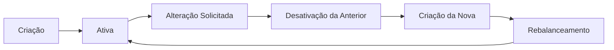

# 📈 Serviço de Trading - Microsserviço de Gestão de Cestas de Investimento

## 📋 Sumário

- [Visão Geral](#-visão-geral)
- [Conceito do Microsserviço](#-conceito-do-microsserviço)
- [Arquitetura](#-arquitetura)
- [Pré-requisitos e Configuração Inicial](#-pré-requisitos-e-configuração-inicial)
- [Tecnologias Utilizadas](#-tecnologias-utilizadas)
- [Estrutura do Projeto](#-estrutura-do-projeto)
- [Funcionalidades Principais](#-funcionalidades-principais)
- [Fluxos de Negócio](#-fluxos-de-negócio)
- [Integrações](#-integrações)
- [Documentação da API](#-documentação-da-api)
- [Testes](#-testes)
- [CI/CD](#-cicd)

---

## 🎯 Visão Geral

O **Serviço de Trading** é um microsserviço responsável pela gestão administrativa de **cestas de recomendação de ativos** (Top Five) e pelo gerenciamento de **cotações da B3**. Este serviço atua como o núcleo central para:

- 📊 **Criação e alteração** de cestas Top Five (5 ativos mais recomendados)
- 🔄 **Rebalanceamento automático** de carteiras de clientes
- 💹 **Processamento de cotações** da B3 a partir de arquivos COTAHIST
- 📈 **Consulta de histórico** de cestas e cotações
- 🏦 **Integração com conta master** para gestão de custódia

---

## 💡 Conceito do Microsserviço

### O que é uma Cesta Top Five?

Uma **Cesta Top Five** é uma seleção de **5 ativos** (ações) recomendados pela equipe de análise do banco, onde cada ativo possui um **percentual de alocação** que somados totalizam **100%**. 

**Exemplo de Cesta:**
```
Top Five - Março 2026
├── PETR4: 30% (Petrobras)
├── VALE3: 25% (Vale)
├── ITUB4: 20% (Itaú)
├── ABEV3: 15% (Ambev)
└── RENT3: 10% (Localiza)
```

### Ciclo de Vida de uma Cesta



1. **Criação Inicial**: Primeira cesta é criada e ativada no sistema
2. **Cesta Ativa**: Apenas uma cesta pode estar ativa por vez
3. **Alteração**: Ao criar uma nova cesta, a anterior é desativada automaticamente
4. **Rebalanceamento**: Dispara processo para ajustar carteiras dos clientes ativos
5. **Histórico**: Todas as cestas (ativas e desativadas) são mantidas para auditoria

### Conceito de Rebalanceamento

O **rebalanceamento** é o processo automático de ajustar as carteiras dos clientes quando há mudança na cesta Top Five:

- 🔴 **Ativos Removidos**: Ações que saíram da nova cesta são vendidas
- 🟢 **Ativos Adicionados**: Novas ações são compradas
- ⚖️ **Ativos Mantidos**: Percentuais são ajustados conforme a nova alocação
- 💰 **Resíduo**: Valores não investidos ficam como saldo disponível

**Exemplo de Rebalanceamento:**
```
Cesta Anterior:
├── PETR4: 30%
├── VALE3: 25%
├── ITUB4: 20%
├── BBDC4: 15%  ❌ Será removido
└── WEGE3: 10%  ❌ Será removido

Cesta Nova:
├── PETR4: 25%  ⚖️ Percentual ajustado
├── VALE3: 20%  ⚖️ Percentual ajustado
├── ITUB4: 20%  ⚖️ Mantido
├── ABEV3: 20%  ✅ Novo ativo
└── RENT3: 15%  ✅ Novo ativo
```

### Processamento de Cotações B3

O serviço processa arquivos **COTAHIST** da B3 (Bolsa de Valores do Brasil), que contêm:

- 📅 Data do pregão
- 📊 Preços de abertura, fechamento, máximo e mínimo
- 📈 Volume negociado
- 🏷️ Códigos dos ativos (tickers)
- 🔢 Tipo de mercado (à vista, fracionário, etc.)

Estes dados são essenciais para:
- Calcular valores de compra/venda durante o rebalanceamento
- Exibir cotações atuais nas cestas
- Validar se os ativos da cesta possuem liquidez

---

## 🏗️ Arquitetura

### Arquitetura de Microsserviços

```
┌─────────────────────────────────────────────────────────────┐
│                    ECOSSISTEMA DE SERVIÇOS                  │
├─────────────────────────────────────────────────────────────┤
│                                                             │
│  ┌──────────────┐        ┌──────────────────┐             │
│  │   Clientes   │◄──────►│  Trading Service │             │
│  │   Service    │        │   (Este Projeto) │             │
│  └──────────────┘        └──────────────────┘             │
│         ▲                         │                         │
│         │                         │                         │
│         │                         ▼                         │
│         │              ┌──────────────────┐                │
│         │              │ Rebalanceamento  │                │
│         └──────────────│     Service      │                │
│                        └──────────────────┘                │
│                                 │                           │
│                                 ▼                           │
│                        ┌──────────────────┐                │
│                        │ Conta Gráfica    │                │
│                        │     Service      │                │
│                        └──────────────────┘                │
│                                                             │
└─────────────────────────────────────────────────────────────┘
         │                       │                    │
         ▼                       ▼                    ▼
   PostgreSQL              Apache Kafka          Conta Master
```

### Comunicação entre Serviços

- **Síncrona (REST/HTTP)**: 
  - Feign Clients para chamadas REST a outros microsserviços
  - Timeout configurável por endpoint
  
- **Assíncrona (Kafka)**:
  - Publicação de eventos de rebalanceamento
  - Consumo de eventos de clientes

### Camadas da Aplicação

```
┌─────────────────────────────────────────┐
│          CONTROLLER LAYER                │  ← Endpoints REST
├─────────────────────────────────────────┤
│           SERVICE LAYER                  │  ← Lógica de negócio
├─────────────────────────────────────────┤
│           MAPPER LAYER                   │  ← Conversão DTO/Entity
├─────────────────────────────────────────┤
│         REPOSITORY LAYER                 │  ← Acesso a dados
├─────────────────────────────────────────┤
│          DATABASE (PostgreSQL)           │  ← Persistência
└─────────────────────────────────────────┘

         INTEGRAÇÕES EXTERNAS
┌──────────────┐  ┌──────────────┐
│ Feign Client │  │    Kafka     │
└──────────────┘  └──────────────┘
```

---

## ⚙️ Pré-requisitos e Configuração Inicial

### 1. Dependências Obrigatórias

Antes de iniciar, certifique-se de ter:

- ☕ **Java 17** ou superior
- 🔧 **Maven 3.8+**
- 🐘 **PostgreSQL 15+** rodando na porta `5433`
- 📨 **Apache Kafka** rodando na porta `9092`
- 🐳 **Docker** (opcional, para containers)

### 2. ⚠️ Common Library (IMPORTANTE)

Este projeto depende da biblioteca compartilhada `com.itau:common.library:0.0.12` que **DEVE estar instalada localmente** no seu repositório Maven ou publicada no GitHub Packages.

**Sem a Common Library, o projeto não irá compilar!**

#### Opção 1: Instalar Localmente

```bash
# Clone o repositório da common library
git clone https://github.com/desafio-itau/itau-common-library.git
cd itau-common-library

# Instale no repositório Maven local
mvn clean install
```

#### Opção 2: Configurar GitHub Packages

Se a biblioteca está publicada no GitHub Packages, configure suas credenciais:

**Criar/editar `~/.m2/settings.xml`:**

```xml
<settings>
  <servers>
    <server>
      <id>github</id>
      <username>SEU_USUARIO_GITHUB</username>
      <password>SEU_TOKEN_GITHUB</password>
    </server>
  </servers>
</settings>
```

**Gerar Token GitHub:**
1. Acesse: GitHub → Settings → Developer settings → Personal access tokens
2. Gere um token com permissão `read:packages`
3. Use o token como password no settings.xml

### 3. Configuração de Variáveis de Ambiente

Copie o arquivo de exemplo e configure:

```bash
cp env/.env.example env/.env
```

**Edite o arquivo `env/.env`:**

```bash
# Database
DESAFIO_ITAU_DB_NAME=desafio_itau_db
DESAFIO_ITAU_DB_USER=postgres
DESAFIO_ITAU_DB_PASSWORD=postgres

# Serviços Externos (ajuste conforme seu ambiente)
ITAU_SRV_CONTA_GRAFICA_URL=http://localhost:8080/api/contas-graficas
ITAU_SRV_CLIENTES_URL=http://localhost:8080/api/clientes
ITAU_SRV_CUSTODIA_URL=http://localhost:8082/api/custodia-master
ITAU_SRV_REBALANCEAMENTO_URL=http://localhost:8082/api/rebalanceamentos
```

### 4. Arquivo de Cotações B3

Certifique-se de ter o arquivo COTAHIST na pasta correta:

```bash
# Estrutura esperada
srv.trading.service/
└── cotacoes/
    └── COTAHIST_M012026.TXT
```

Este arquivo é necessário para processar as cotações da B3.

### 5. Apache Kafka

Certifique-se de que o Kafka está rodando:

```bash
# Verificar se o Kafka está acessível
nc -zv localhost 9092
```

---

## 🛠️ Tecnologias Utilizadas

| Tecnologia | Versão | Propósito |
|------------|--------|-----------|
| **Java** | 17 | Linguagem de programação |
| **Spring Boot** | 3.4.5 | Framework principal |
| **Spring Data JPA** | 3.4.5 | ORM e persistência |
| **PostgreSQL** | 15+ | Banco de dados relacional |
| **Apache Kafka** | Latest | Mensageria assíncrona |
| **OpenFeign** | 4.x | Cliente HTTP declarativo |
| **Lombok** | Latest | Redução de boilerplate |
| **SpringDoc OpenAPI** | 2.8.0 | Documentação Swagger |
| **JaCoCo** | 0.8.12 | Cobertura de testes (90%) |
| **JUnit 5** | 5.x | Testes unitários |
| **Mockito** | 5.x | Mocks para testes |
| **H2 Database** | Latest | Testes em memória |

---

## 📁 Estrutura do Projeto

```
srv.trading.service/
├── src/
│   ├── main/
│   │   ├── java/com/itau/srv/trading/service/
│   │   │   ├── controller/           # Endpoints REST
│   │   │   │   ├── CestaController.java
│   │   │   │   └── CotacaoController.java
│   │   │   │
│   │   │   ├── service/              # Lógica de negócio
│   │   │   │   ├── CestaService.java
│   │   │   │   ├── CotacaoService.java
│   │   │   │   ├── ItemCestaService.java
│   │   │   │   └── CustodiaMaterService.java
│   │   │   │
│   │   │   ├── mapper/               # Conversão DTO ↔ Entity
│   │   │   │   ├── CestaMapper.java
│   │   │   │   └── CotacaoMapper.java
│   │   │   │
│   │   │   ├── repository/           # Acesso ao banco
│   │   │   │   ├── CestaRecomendacaoRepository.java
│   │   │   │   ├── ItemCestaRepository.java
│   │   │   │   └── CotacaoRepository.java
│   │   │   │
│   │   │   ├── model/                # Entidades JPA
│   │   │   │   ├── CestaRecomendacao.java
│   │   │   │   ├── ItemCesta.java
│   │   │   │   └── Cotacao.java
│   │   │   │
│   │   │   ├── dto/                  # Data Transfer Objects
│   │   │   │   ├── cesta/
│   │   │   │   ├── cotacaob3/
│   │   │   │   ├── custodiamaster/
│   │   │   │   └── itemcesta/
│   │   │   │
│   │   │   ├── feign/                # Clientes HTTP
│   │   │   │   ├── ClientesFeignClient.java
│   │   │   │   ├── CustodiaMasterFeignClient.java
│   │   │   │   └── RebalanceamentoFeignClient.java
│   │   │   │
│   │   │   └── util/                 # Utilitários
│   │   │       └── CotahistParser.java
│   │   │
│   │   └── resources/
│   │       ├── application.yaml      # Configurações
│   │       └── application-test.yaml # Config de testes
│   │
│   └── test/                         # Testes unitários
│       └── java/com/itau/srv/trading/service/
│           ├── controller/
│           ├── service/
│           └── mapper/
│
├── cotacoes/                         # Arquivos COTAHIST
│   └── COTAHIST_M012026.TXT
│
├── env/                              # Variáveis de ambiente
│   └── .env
│
├── .github/workflows/                # CI/CD
│   └── ci-cd.yml
│
├── pom.xml                           # Dependências Maven
└── README.md                         # Este arquivo
```

---

## 🎯 Funcionalidades Principais

### 1. 📊 Gestão de Cestas Top Five

#### Criar/Alterar Cesta
```http
POST /api/admin/cesta
Content-Type: application/json

{
  "nome": "Top Five - Março 2026",
  "itens": [
    { "ticker": "PETR4", "percentual": 30.00 },
    { "ticker": "VALE3", "percentual": 25.00 },
    { "ticker": "ITUB4", "percentual": 20.00 },
    { "ticker": "ABEV3", "percentual": 15.00 },
    { "ticker": "RENT3", "percentual": 10.00 }
  ]
}
```

**Regras de Negócio:**
- ✅ Exatamente 5 ativos
- ✅ Percentuais devem somar 100%
- ✅ Apenas uma cesta ativa por vez
- ✅ Ao criar nova, a anterior é desativada
- ✅ Dispara rebalanceamento automático

#### Consultar Cesta Ativa
```http
GET /api/admin/cesta/atual
```

Retorna a cesta atualmente ativa com cotações atualizadas.

#### Histórico de Cestas
```http
GET /api/admin/cesta/historico
```

Retorna todas as cestas (ativas e desativadas) com suas datas de criação/desativação.

### 2. 💹 Gestão de Cotações

#### Salvar Cotações do Arquivo TXT
```http
POST /api/cotacoes
```

Processa o arquivo `COTAHIST_M012026.TXT` e salva no banco de dados.

**O que é feito:**
1. Lê o arquivo COTAHIST da pasta `cotacoes/`
2. Filtra apenas mercado à vista (código 10)
3. Parseia cada linha do arquivo (posições fixas)
4. Salva cotações no PostgreSQL
5. Retorna lista de cotações processadas

#### Listar Todas as Cotações
```http
GET /api/cotacoes
```

#### Buscar Cotação por Ticker
```http
GET /api/cotacoes/PETR4
```

### 3. 🏦 Custódia Master

#### Consultar Custódia
```http
GET /api/admin/conta-master/custodia
```

Retorna a custódia da conta master com:
- Ativos em carteira
- Quantidades
- Preços médios
- Valor total
- Resíduo (saldo não investido)

---

## 🔄 Fluxos de Negócio

### Fluxo 1: Criação da Primeira Cesta

```
1. Admin envia POST /api/admin/cesta
2. Service valida:
   ├─ 5 ativos?
   ├─ Percentuais = 100%?
   └─ Cotações existem?
3. Não existe cesta ativa
4. Cria nova cesta (ATIVA)
5. Salva itens da cesta
6. Retorna CriarTopFiveResponseDTO
   └─ rebalanceamentoDisparado = false
```

### Fluxo 2: Alteração de Cesta (Rebalanceamento)

```
1. Admin envia POST /api/admin/cesta (nova composição)
2. Service valida requisição
3. Existe cesta ativa!
4. Service executa:
   ├─ Busca clientes ativos (Feign Client)
   ├─ Desativa cesta anterior
   ├─ Cria nova cesta (ATIVA)
   ├─ Identifica:
   │  ├─ Ativos removidos
   │  ├─ Ativos adicionados
   │  └─ Ativos mantidos (com ajuste de %)
   ├─ Publica evento no Kafka:
   │  └─ RebalancementoEvent
   │      ├─ cestaAnteriorId
   │      ├─ cestaAtualId
   │      └─ dataExecucao
   └─ Retorna AlterarTopFiveResponseDTO
      ├─ rebalanceamentoDisparado = true
      ├─ ativosRemovidos: [...]
      ├─ ativosAdicionados: [...]
      └─ mensagem com quantidade de clientes
```

### Fluxo 3: Processamento de Rebalanceamento (Assíncrono)

```
1. Serviço de Rebalanceamento consome evento Kafka
2. Para cada cliente ativo:
   ├─ Busca carteira atual
   ├─ Calcula diferenças:
   │  ├─ Vende ativos removidos
   │  ├─ Compra ativos novos
   │  └─ Ajusta quantidades dos mantidos
   ├─ Atualiza custódia do cliente
   └─ Registra transações
3. Atualiza conta master (consolidação)
4. Envia notificações aos clientes
```

---

## 🔗 Integrações

### Feign Clients (Síncronos)

#### 1. ClientesFeignClient
```java
GET /api/clientes?ativo=true
```
- **Objetivo**: Buscar lista de clientes ativos
- **Usado em**: Rebalanceamento
- **Timeout**: 3s conexão, 8s leitura

#### 2. CustodiaMasterFeignClient
```java
GET /api/custodia-master
```
- **Objetivo**: Consultar custódia da conta master
- **Usado em**: Consultas administrativas
- **Timeout**: 3s conexão, 8s leitura

#### 3. RebalanceamentoFeignClient
```java
POST /api/rebalanceamentos/eventos
```
- **Objetivo**: Publicar eventos de rebalanceamento
- **Usado em**: Alteração de cestas
- **Timeout**: 3s conexão, 8s leitura

### Kafka (Assíncrono)

#### Tópico: `rebalanceamento-events`

**Produtor (este serviço):**
```json
{
  "cestaAnteriorId": 1,
  "cestaAtualId": 2,
  "dataExecucao": "2026-03-01T09:00:00"
}
```

**Consumidor:** Serviço de Rebalanceamento

---

## 📚 Documentação da API

### Swagger UI

A documentação interativa está disponível em:

```
http://localhost:8081/swagger-ui.html
```

### OpenAPI JSON

Especificação OpenAPI 3.0:

```
http://localhost:8081/v3/api-docs
```

### Principais Endpoints

| Método | Endpoint | Descrição |
|--------|----------|-----------|
| POST | `/api/admin/cesta` | Criar/alterar cesta |
| GET | `/api/admin/cesta/atual` | Obter cesta ativa |
| GET | `/api/admin/cesta/historico` | Histórico de cestas |
| GET | `/api/admin/{cestaId}` | Obter cesta por ID |
| GET | `/api/admin/conta-master/custodia` | Custódia master |
| POST | `/api/cotacoes` | Salvar cotações do TXT |
| GET | `/api/cotacoes` | Listar cotações |
| GET | `/api/cotacoes/{ticker}` | Cotação por ticker |

---

## 🧪 Testes

### Cobertura de Testes

Este projeto mantém **90% de cobertura de código** validada pelo JaCoCo.

### Executar Testes

```bash
# Todos os testes
mvn test

# Testes com relatório de cobertura
mvn test jacoco:report

# Visualizar relatório
open target/site/jacoco/index.html
```

---

## 🚀 CI/CD

### GitHub Actions

Pipeline automatizado em `.github/workflows/ci-cd.yml`:

```yaml
Triggers:
- Push (main, develop)
- Pull Request
- Manual (workflow_dispatch)

Jobs:
1. Build
   ├─ Checkout código
   ├─ Setup Java 17
   ├─ Cache Maven
   └─ Build do projeto

2. Testes
   ├─ Executar testes unitários
   ├─ Gerar relatório JaCoCo
   └─ Verificar cobertura >= 90%

3. Quality
   ├─ Upload para Codecov
   └─ Publicar resultados de testes

4. Artifacts
   ├─ Upload relatório JaCoCo
   └─ Upload relatórios de teste
```

### Validações Automáticas

- ✅ Compilação sem erros
- ✅ Todos os testes passando
- ✅ Cobertura >= 90%
- ✅ Code style (checkstyle)
- ✅ Segurança de dependências

---

### Padrões Utilizados

- **DTO Pattern**: Separação de DTOs de request/response
- **Repository Pattern**: Acesso a dados via JPA
- **Service Layer**: Lógica de negócio isolada
- **Mapper Pattern**: Conversão DTO ↔ Entity
- **Feign Client**: Comunicação entre microsserviços
